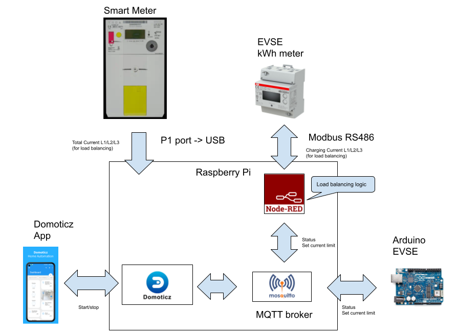
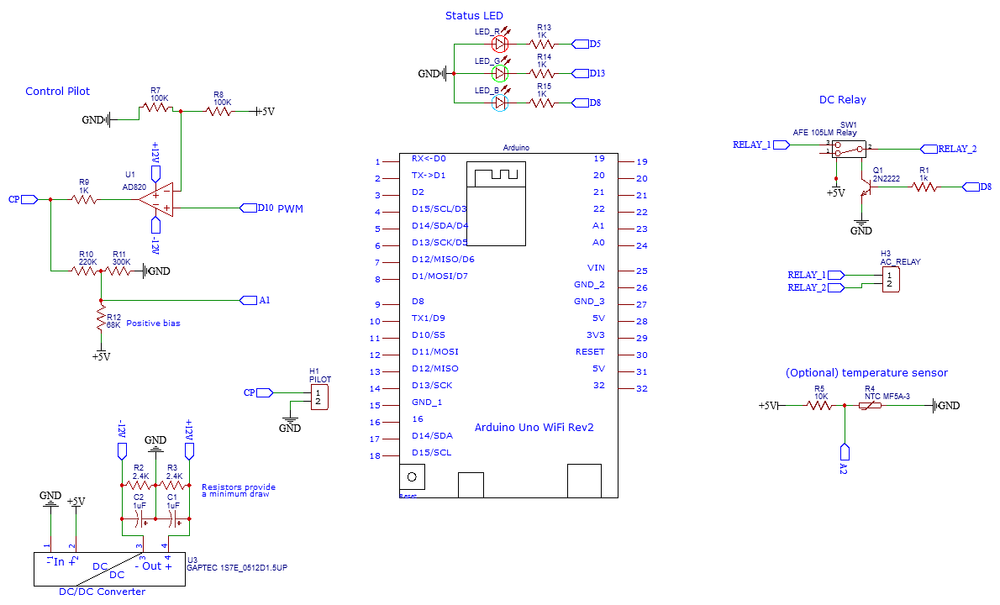
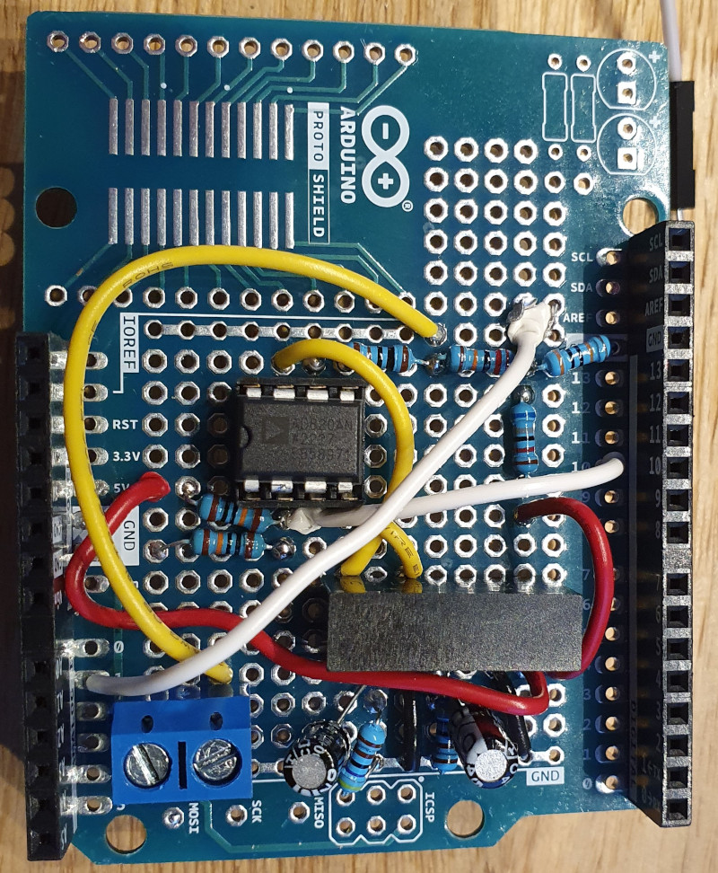
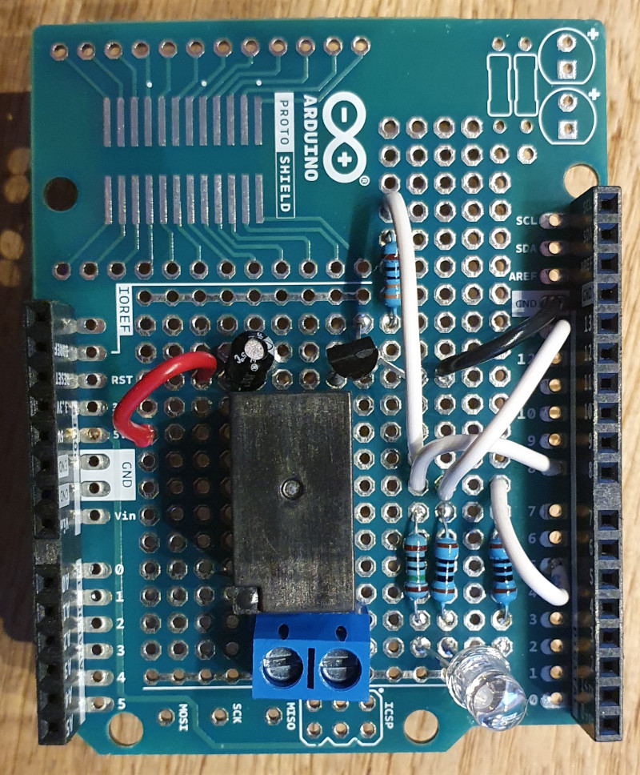
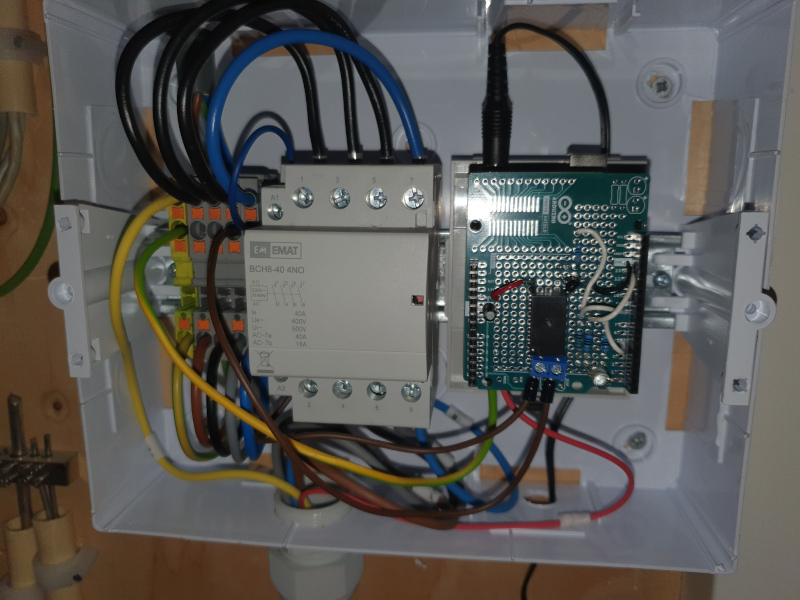
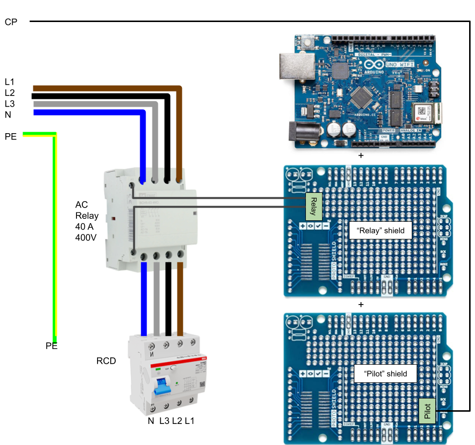

# ArduinoEVSE

A simple EVSE (electric vehicle supply equipment or "wall charger") built using an Arduino and open source software.

Inspired by [OpenEVSE](https://github.com/OpenEVSE) and [Arduino EV J1772 Charging Station](https://www.instructables.com/Arduino-EV-J1772-Charging-Station/).

## Overview



I use [Domoticz](https://github.com/domoticz/domoticz), [Mosquitto](https://github.com/eclipse/mosquitto) and [Node-RED](https://github.com/node-red/node-red) to control the charging with the ArduinoEVSE.

Domoticz, Mosquitto and Node-RED run on a Raspberry Pi. I connected the smart meter with a P1 to USB adapter. This gives me the total household load. I use a [ABB EV3 012-100 kWh meter](https://new.abb.com/products/2CMA290881R1000/ev3-012-100) that I read through a Modbus RS486 to USB adapter. This gives me the actual charging current and also measures the total kWh charged for financial purposes.

### Controlling the ArduinoEVSE

By setting up some dummy switches and sensors in Domoticz and connecting them to the ArduinoEVSE through Node-RED, I can start, stop and monitor the charging through the Domoticz app.


### Load balancing

For load balancing I use the output of the smart meter on the P1 port to measure the total load. My house has a 3x25A connection that must not be exceeded.

To measure the actual current the EV is drawing, I installed a separate kWh meter on the EVSE group that I read using Modbus RS486 every 20 seconds. 

In Node-RED I set up some flows to do the load balancing calculations and send the maximum allowed current (current limit) to the ArduinoEVSE via MQTT.


## Hardware
I got the [Arduino Uno WiFi Rev2](https://store.arduino.cc/products/arduino-uno-wifi-rev2) board.

And 2 [Proto Shields (Uno Size)](https://store.arduino.cc/collections/shields/products/proto-shield-rev3-uno-size) to solder the custom circuits on and be able to easily plug it onto the Arduino.

On the bottom Proto Shield I soldered the Control Pilot circuit and together with the DC/DC converter.

See the schematic below:


I used screw terminals for connecting the CP lead from the charging cable and for connecting the AC relay.

### Pilot shield

The finished Pilot shield looks like this:


### Relay shield

On the top Proto Shield I soldered the relay and the status LED.

The finished Relay shield looks like this:


### AC contactor and enclosure

Then I put everything into an enclosure with DIN rail and attached the AC  contactor:

This AC contactor is 3 phase, normally open and rated for 400V 40A which is more that sufficient for my use case.

### GFCI

Some EVSEs have a Ground Fault Circuit Interrupter built-in, but I chose to externalize it and put it in my fuse box next. 
I used a [ABB F200 B Type](https://new.abb.com/low-voltage/products/system-pro-m/residual-current-devices/f200-b-type) residual current circuit breakers that is also sensitive to DC currents. 



## Getting Started

The project uses [PlatformIO](https://platformio.org/) to build and upload the firmware to the Arduino. You can use the VSCode plugin or install PlatformIO CLI.

Create a file `src/arduino_secrets.h`:
```
#define WIFI_SSID "myssid"
#define WIFI_WPA_PASS "mypass"
```
This is needed to set the WiFi SSID and password until it is possible to configure through some other means.

Make sure your Arduino is connected to your computer and is detected by PlatformIO:
```
pio device list
```

Run PlatformIO to build and upload the firmware. It should download the necessary libraries automatically:
```
pio run -t upload
```

After this is successful you can disconnect the Arduino and it will run the firmware on its own.

## MQTT

The Arduino EVSE will not start charging by itself. It can be controlled through MQTT.

Once connected to WiFi, the Arduino will try to connect to a MQTT broker. The default topic names are `ArduinoEVSE/in` for commands and `ArduinoEVSE/out` for status updates.

### MQTT status updates

Every couple of seconds the Arduino will send a status message on the `ArduinoEVSE/out` topic:

Status message: `<State>,<VehicleState>,<CurrentLimit>,<PilotVoltage>`
See `ChargeController.h` for the different state values.

### MQTT Commands

Send a message on the `ArduinoEVSE/in` topic to do the following:

* Start Charging message: `0`

* Stop Charging message: `1`

* Set Current Limit message: `2,<CurrentLimit>` for example `2,16.0`
